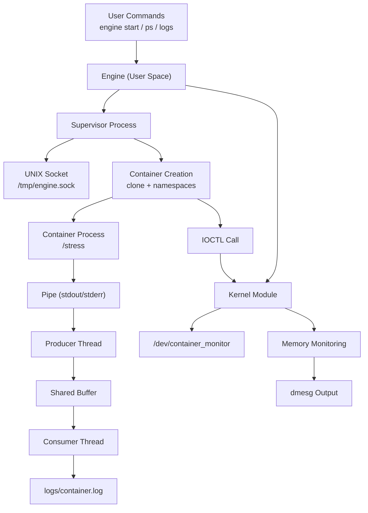
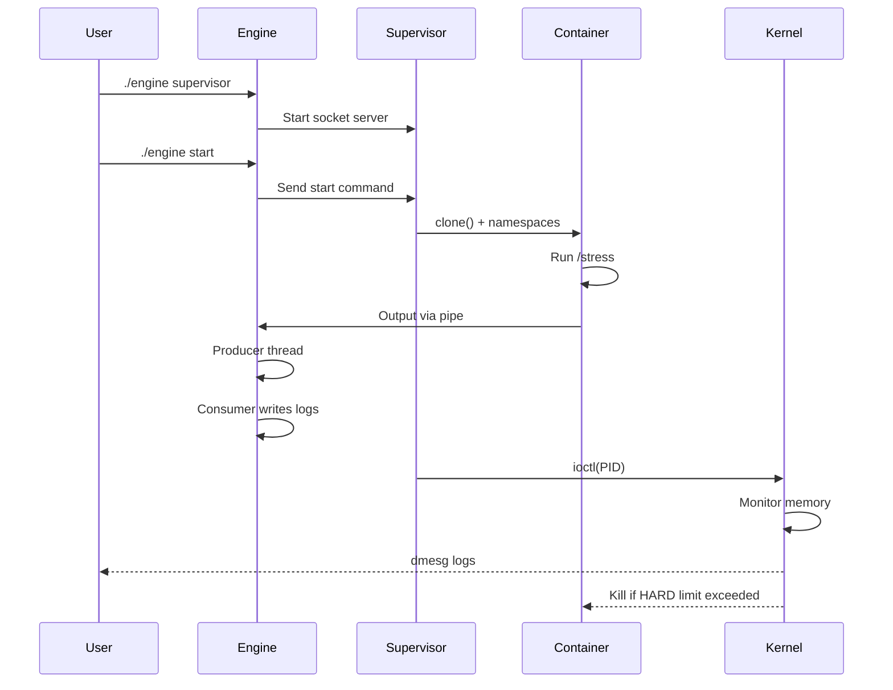
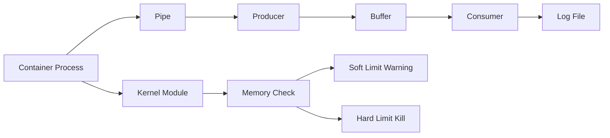
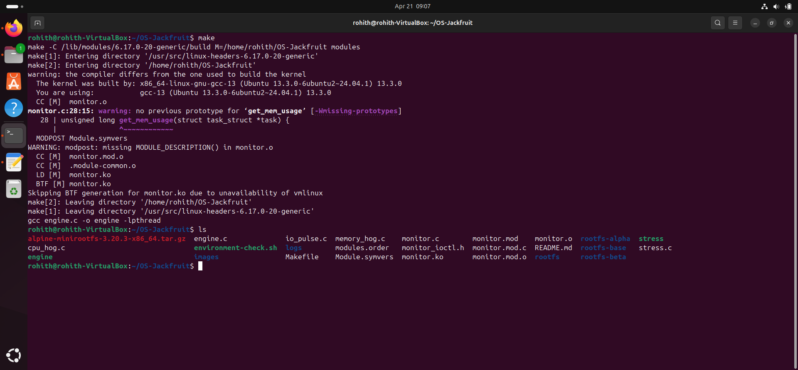
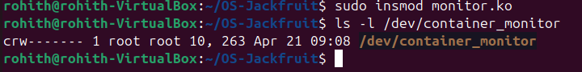
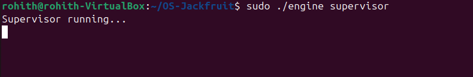
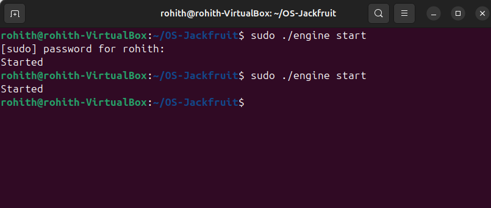
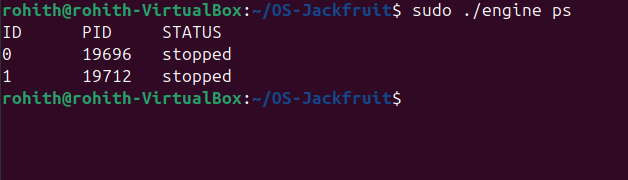
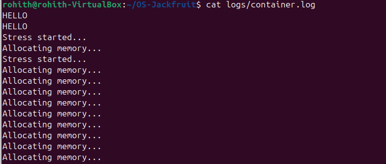
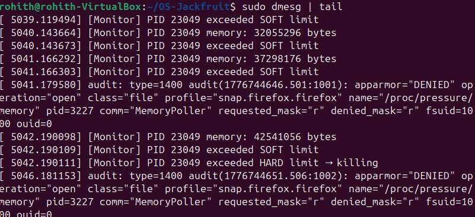

# 🐳 Mini Container Runtime with Kernel-Level Monitoring

## 👨‍🎓 Student Details

* **Teammate 1:**
  * Name: ROHITH G S
  * SRN: PES2UG24AM138
* **Teammate 2:**
  * Name: PAVAN KISHOR M
  * SRN: PES2UG24AM111

---

## 📌 Overview

This project implements a lightweight **container runtime in C** using Linux system calls and a **kernel module** for monitoring container memory usage.

It demonstrates key OS concepts:

* Process isolation using namespaces
* Inter-process communication (IPC)
* Producer–Consumer synchronization
* User–kernel communication via `ioctl`
* Resource monitoring and enforcement

---

## 🎯 Objectives

* Build a mini container runtime using `clone()`
* Implement logging using Producer–Consumer model
* Enable communication via UNIX domain sockets
* Develop a kernel module for memory monitoring
* Enforce **soft and hard memory limits**

---

## 🏗️ System Architecture


### 🔍 Explanation

* The **engine** acts as a client/server system.
* The **supervisor** manages container lifecycle.
* Output flows via **pipe → producer → buffer → consumer → logs**.
* Kernel module monitors memory and logs to `dmesg`.

---

## 🔄 Workflow Diagram



---

## 🧠 Core Concept Diagram



---

## ⚙️ Features

### 🔹 Container Runtime

* Uses `clone()` with:
  * `CLONE_NEWPID`
  * `CLONE_NEWUTS`
  * `CLONE_NEWNS`
* Filesystem isolation via `chroot()`
* Executes `/stress` inside container

---

### 🔹 Supervisor (IPC)

* UNIX socket: `/tmp/engine.sock`
* Commands:
  * `start` → Launch container
  * `ps` → List containers
  * `stop <id>` → Stop container
  * `logs` → View logs

---

### 🔹 Logging System

* Pipe-based output capture
* Producer–Consumer model:
  * Mutex
  * Condition variables

Output stored in:
```
logs/container.log
```

---

### 🔹 Kernel Module Monitoring

* Device: `/dev/container_monitor`
* Uses `ioctl` for PID registration
* Periodically checks memory

#### 🚨 Limits

* Soft Limit → Warning
* Hard Limit → Process killed

---

## 📁 Project Structure

```
OS-Jackfruit/
│
├── engine.c
├── monitor.c
├── stress.c
├── Makefile
├── logs/
├── rootfs/
├── README.md
└── .gitignore
```

---

## 🛠️ Requirements

* Ubuntu/Linux (VM recommended)
* GCC
* Make

Install dependencies:
```bash
sudo apt install build-essential linux-headers-$(uname -r)
```

---

## ⚙️ Build Instructions

```bash
make clean
make
```

---

## 🚀 Execution Steps

### 1. Load Kernel Module

```bash
sudo insmod monitor.ko
```

Verify:
```bash
ls -l /dev/container_monitor
```

---

### 2. Start Supervisor

```bash
sudo ./engine supervisor
```

---

### 3. Start Container

```bash
sudo ./engine start
```

---

### 4. List Containers

```bash
sudo ./engine ps
```

---

### 5. View Logs

```bash
cat logs/container.log
```

---

### 6. Kernel Monitoring Output

```bash
sudo dmesg | grep Monitor
```

---

## 📊 Sample Outputs

### Logs

```
HELLO
Stress started...
Allocating memory...
```

---

### Kernel Logs

```
[Monitor] Registered PID: 23049
[Monitor] PID 23049 memory: 32055296 bytes
[Monitor] PID 23049 exceeded SOFT limit
[Monitor] PID 23049 exceeded HARD limit → killing
```

---

## 📸 Screenshots (Submission Order)

### 1. Compilation (`make`)


### 2. Kernel module loading


### 3. Supervisor running


### 4. Container start


### 5. Process list (`ps`)


### 6. Logs (`container.log`)


### 7. Kernel monitoring (`dmesg`)


*(Additional log output)*


---

## 🧠 Concepts Used

* Linux Namespaces
* Process Isolation
* IPC (UNIX sockets, pipes)
* Producer–Consumer Problem
* Kernel Programming
* Memory Management

---

## ⚠️ Notes

* Use `sudo` for privileged operations
* Ensure `rootfs/` contains:
  * `/bin/sh`
  * `/stress`

If `dmesg` is restricted:
```bash
sudo dmesg | tail
```

---

## ✅ Conclusion

This project successfully demonstrates a mini container runtime integrated with kernel-level monitoring and enforcement, combining user-space and kernel-space programming into a complete system.
